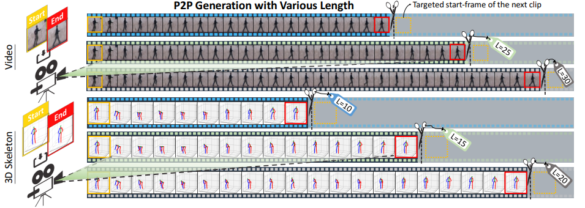
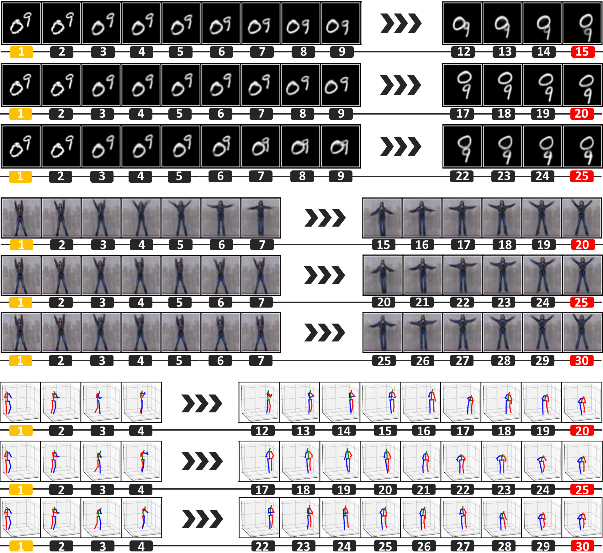

# Point-to-Point Video Generation

[paper](https://arxiv.org/abs/1904.02912) | [project page](https://zswang666.github.io/P2PVG-Project-Page) | [video](https://drive.google.com/file/d/1AV7E1d4QZg--3yxAYbyA1jOp98qIJUIB/view?usp=sharing)

[Tsun-Hsuan Wang*](https://zswang666.github.io/), [Yen-Chi Cheng*](https://yccyenchicheng.github.io/), [Chieh Hubert Lin](https://hubert0527.github.io/), [Hwann-Tzong Chen](https://htchen.github.io/), [Min Sun](https://aliensunmin.github.io/) (* indicate equal contribution)

IEEE International Conference on Computer Vision (ICCV), 2019

This repo is the implementation of our ICCV 2019 paper: ["Point-to-Point Video Generation"](https://arxiv.org/abs/1904.02912) in PyTorch.

Paper: [arXiv](https://arxiv.org/abs/1904.02912), [CVF Open Access](https://arxiv.org/abs/1904.02912)


<!--- (   -->

<!---<p style="text-align:center;"> -->
<p align="center">


</p>

<!-- **Point-to-Point (P2P) Video Generation.** Given a pair of (orange) start- and (red) end-frames in the video and 3D
skeleton domains, our method generates videos with smooth transitional frames of various lengths. The superb controllability
of p2p generation naturally facilitates the modern video editing process.

We will provide our PyTorch implementation for our paper.

Overview
---

**Overview.** We describe the novel components in our model to achieve reliable p2p generation. In Panel (a), our
model is a VAE consisting of posterior qφ, prior pψ, and generator pθ. We use KL-divergence to encourage the posterior to
be similar to the prior. In this way, the generated frame will preserve smooth transition. To control the generation process, we
encode the targeted end-frame xT into a global descriptor. Both posterior and prior are computed by an LSTM considering
not only the input frame, but also the “global descriptor” and “time counter”. We further use the “alignment loss”
to align the encoder and decoder latent space to reinforce the end-frame consistency. In Panel (b), our skip-frame training
has a probability to skip the current frame for each timestamp where the inputs will be ignored completely and the hidden
state will not be propagated at all (indicated by the dashed line). In Panel (c), the control point consistency is achieved by
posing CPC loss on pψ without deteriorating the reconstruction objective of posterior (highlighted in bold). -->

---
### **Generation with various length.**


### **Multiple control points generation.**


### **Loop generation.**


Getting Started
---
**Requirements**

* OS: Ubuntu 16.04
* NVIDIA GPU + CUDA
* Python 3.6
* PyTorch 1.0
* TensorFlow (for Tensorboard)

**Prepare dataset**

First clone this repo:
```
git clone https://github.com/yccyenchicheng/p2pvg.git
cd p2pvg
```

Then create a directory `data_root`, and for each of the dataset we used:

- `MovingMNIST`. The testing sequence is created on the fly. Hence there is no need to preprocess or prepare anything for this dataset.

- `Weizmann`. We crop each frame based on the bounding box from [this url](http://www.wisdom.weizmann.ac.il/~vision/SpaceTimeActions.html). Thus you can download the dataset from the above url and preprocess yourself. Also, you can download ours from [this link](https://drive.google.com/open?id=1bUr6DR1gJa21VI_6B_CB4-gG2dgI7mfJ). Extract the downloaded `.zip` file and put it under `data_root`.

- `Human 3.6M`. First you have to download the dataset from [this url](http://vision.imar.ro/human3.6m/description.php). Then put it under `data_root/processed/`.

- `BAIR Robot Pushing`. Download the dataset from [this url (~30 gb)](https://sites.google.com/view/sna-visual-mpc). Then follows the steps below:
    -  Create a directory `data_root/bair`, put the downloaded `.tar` file under `data_root/bair` and extract the `.tar` file
    ```
    tar -xvf data_root/bair/bair_robot_pushing_dataset_v0.tar -C data_root/bair
    ```
    -  Then use the script `data/convert_bair.py` implemented in [this repo](https://github.com/edenton/svg/blob/master/data/convert_bair.py) to convert the data:
    ```
    python data/convert_bair.py --data_dir data_root/bair
    ```
    this will create the directory `data_root/bair/preprocessed_data` and the training data will be stored under it.

Usage
---

**Training**

To train with `Stochastic MovingMNIST`, run
```
python train.py --dataset mnist --channels 1 --num_digits 2 --max_seq_len 30 --n_past 1 \\
--weight_cpc 100 --weight_align 0.5 --skip_prob 0.5 --batch_size 100 \\
--backbone dcgan --beta 0.0001 --g_dim 128 --z_dim 10 --rnn_size 256
```
and the results, model checkpoints and `.event` files will stored in `logs/`. To visualize the training, run
```
tensorboard --logdir logs
```
and go to `127.0.0.1:6006` in your browser to see the visualization. To train with other datasets, replace `--dataset <other_dataset>`, the corresponding channels `--channels <n_channels>` and other parameters of your choices in the command.

**P2P Generate**

Given a video and a trained model, perform p2p generation via the following command:
```
python generate.py --ckpt <model.pth> --video <your_video.mp4>
```
and the output will be stored at `gen_outputs`.

Citation
---
```
@article{p2pvg2019,
  title={Point-to-Point Video Generation},
  author={Wang, Tsun-Hsuan and Cheng, Yen-Chi and Hubert Lin, Chieh and Chen, Hwann-Tzong and Sun, Min},
  journal={arXiv preprint},
  year={2019}
}

@inproceedings{p2pvg2019,
  title={Point-to-Point Video Generation},
  author={Wang, Tsun-Hsuan and Cheng, Yen-Chi and Hubert Lin, Chieh and Chen, Hwann-Tzong and Sun, Min},
  booktitle={IEEE International Conference on Computer Vision},
  year={2019}
}
```


Acknowledgments
---
This code borrows heavily from the [SVG](https://github.com/edenton/svg). And we also adapt the code from [VideoPose3D](https://github.com/facebookresearch/VideoPose3D) for the preprocessing of Human 3.6M. A huge thanks to them!