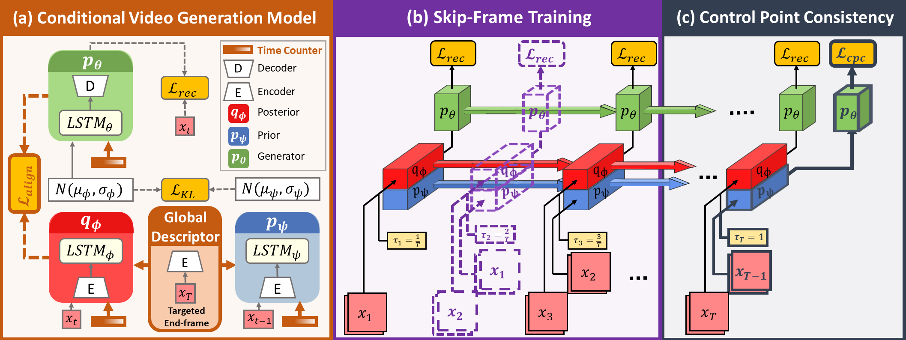
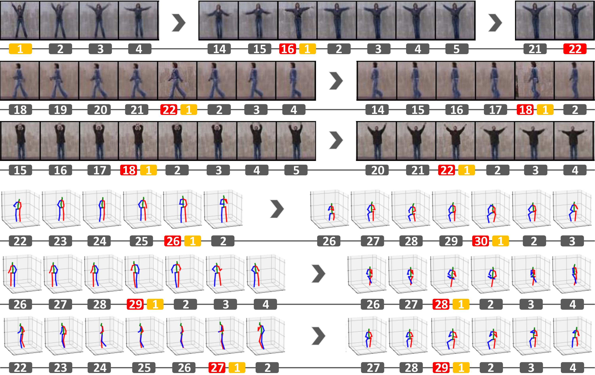

# Point-to-Point Video Generation
[project page](https://www.google.com) | [paper](https://www.google.com) | [video](https://drive.google.com/file/d/1AV7E1d4QZg--3yxAYbyA1jOp98qIJUIB/view?usp=sharing)


<!--- (   -->

<p style="text-align:center;">


</p>

**Point-to-Point (P2P) Video Generation.** Given a pair of (orange) start- and (red) end-frames in the video and 3D
skeleton domains, our method generates videos with smooth transitional frames of various lengths. The superb controllability
of p2p generation naturally facilitates the modern video editing process.

We will provide our PyTorch implementation for our paper very soon.

Overview
---

**Overview.** We describe the novel components in our model to achieve reliable p2p generation. In Panel (a), our
model is a VAE consisting of posterior qφ, prior pψ, and generator pθ. We use KL-divergence to encourage the posterior to
be similar to the prior. In this way, the generated frame will preserve smooth transition. To control the generation process, we
encode the targeted end-frame xT into a global descriptor. Both posterior and prior are computed by an LSTM considering
not only the input frame, but also the “global descriptor” and “time counter”. We further use the “alignment loss”
to align the encoder and decoder latent space to reinforce the end-frame consistency. In Panel (b), our skip-frame training
has a probability to skip the current frame for each timestamp where the inputs will be ignored completely and the hidden
state will not be propagated at all (indicated by the dashed line). In Panel (c), the control point consistency is achieved by
posing CPC loss on pψ without deteriorating the reconstruction objective of posterior (highlighted in bold).

Results
---
### **Generation with various length.**


### **Multiple control points generation.**


### **Loop generation.**


Usage
---
Coming soon.

Citation
---
```
@article{p2pvg2019,
  title={Point-to-Point Video Generation},
  author={Wang, Tsun-Hsuan and Cheng, Yen-Chi and Hubert Lin, Chieh and Chen, Hwann-Tzong and Sun, Min},
  journal={arXiv preprint}
  year={2019}
}
```